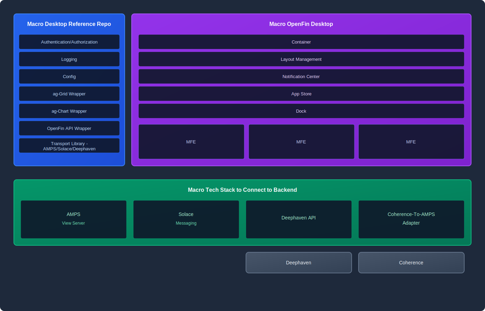

# Macro Desktop Architecture

## Overview

This diagram illustrates the architecture of the Macro Desktop system built on OpenFin Workspace, showing the key components and technology stack.

## Components

### Macro Desktop Reference Repo
Cross-application services and wrappers provided by the Macro Desktop Reference Repository.

### Macro OpenFin Desktop
Core OpenFin Workspace capabilities including Container, Layout Management, Notification Center, App Store, Dock, and Micro Frontends (MFEs).

### Macro Tech Stack to Connect to Backend
Backend connectivity layer featuring AMPS View Server, Solace Messaging, Deephaven API, and Coherence-To-AMPS Adapter, with underlying Deephaven and Coherence systems.
